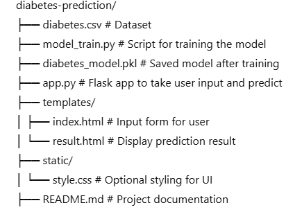
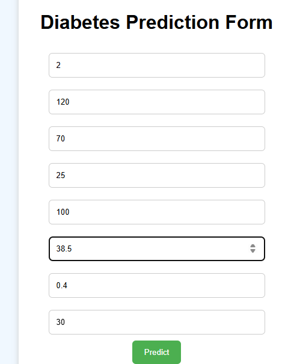
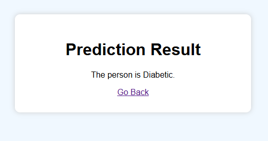

# Diabetes Prediction using Machine Learning

This project aims to predict whether a person is likely to have diabetes based on certain medical attributes. It uses supervised machine learning algorithms and is implemented in Python with the help of libraries such as pandas, scikit-learn, and matplotlib.

## Project Overview

Early detection of diabetes can help manage and prevent the disease effectively. In this project, we use a publicly available dataset to train a predictive model that can determine if a patient is likely to be diabetic based on input features like glucose level, blood pressure, insulin level, etc.

## Dataset

The dataset used is the **Pima Indians Diabetes Dataset**, which includes the following features:

- Pregnancies
- Glucose
- BloodPressure
- SkinThickness
- Insulin
- BMI
- DiabetesPedigreeFunction
- Age
- Outcome (1: Diabetic, 0: Non-Diabetic)

The dataset is typically available in CSV format (`diabetes.csv`).

## Project Structure

## How It Works

1. **Data Preprocessing**
   - Handles missing values (e.g., zeros in non-logical columns)
   - Splits data into training and test sets

2. **Model Training**
   - Uses a classifier like Logistic Regression, Random Forest, or SVM
   - Evaluates accuracy using metrics like accuracy score and confusion matrix
   - Saves the trained model using `pickle`

3. **Web Application**
   - A Flask app where users can enter their medical info
   - Predicts whether the user is diabetic or not using the trained model

## Installation

1. Clone the repository
   
   git clone https://github.com/your-username/diabetes-prediction.git
   cd diabetes-prediction

2.  Install dependencies:
    pip install flask pandas scikit-learn

3. Train the model (optional, if model file not provided)
     python model_train.py

4. Run the Flask application
      python app.py

5. Open your browser and visit
    http://127.0.0.1:5000/

## Requirements
   Python 3.x

   pandas

   numpy

   scikit-learn

   flask

   matplotlib (optional for EDA)

## UI PREVIEW
 ## INPUT PAGE

## RESULT PAGE

## Future Improvements

   Add better visualizations for user feedback

   Use deep learning models for improved accuracy

   Deploy the app using platforms like Heroku or AWS

   Implement user authentication to track personal history

## Author
  This project was developed as part of a Machine Learning learning module by ** R.Dharani sri **. It serves as a foundational project for health-based predictive analytics.
